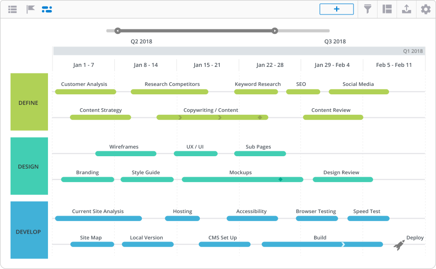

# FoodApp
Web Application About Food by NodeJS

Member: Nguyễn Hoàng Anh

# Website timeline

### I. Define
:white_large_square: Customer Analysis

:white_large_square: Content Strategy

:white_large_square: Research Competitors

:white_large_square: Copywriting / Content

:white_large_square: Keyword Research

:white_large_square: SEO

:white_large_square: Content review

:white_large_square: Social Media

### II. Design
:white_check_mark: Branding

:white_large_square: Wireframes

:white_large_square: Style Guide

:white_large_square: UX / UI

:white_large_square: Mockups

:white_large_square: Sub Pages

:white_large_square: Design Preview

### III. Develope
:white_large_square: Current Site Analysis

:white_large_square: Site Map

:white_check_mark: Local Version

:white_check_mark: Hosting

:white_large_square: CMS Set Up

:white_large_square: Accessibility

:white_large_square: Build

:white_large_square: Browser Testing

:white_large_square: Speed Test

:white_large_square: Deploy

# Website swimlane

